# Group 4 Choo Crew
|Name| Module|
|-|-|
|Mari Inglese | CTC|
|Connor Kariotis | SW Wayside Controller|
|Oliver Kettleson-Belinkie| HW Wayside Controller|
|Ledi Zhao | Train Model|
|Julen Coca Knorr | SW Train Controller|
|James Struyk | HW Train Controller|

# User Help
**This code requires the following:**
- Python version ... 
- Watchdog
- Pillow
- 

## CTC
The CTC is resonsible for dispatching trains and overlooking active train status.

### CTC Manual Mode
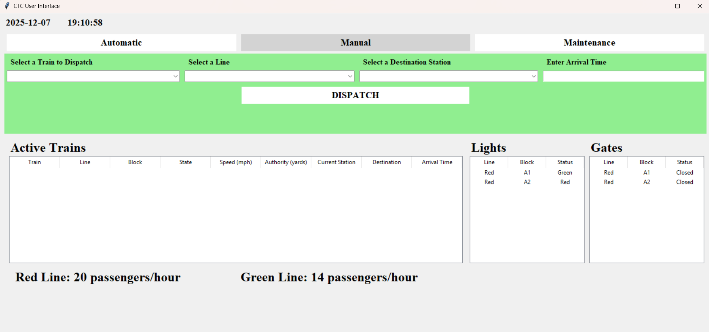

- In manual mode, The dispatcher can choose a train, line, destination, and arrival time.
- The train is selected by the selected by the first selection box, the line is selected by the second selection block, and the destinination is selected by the third selection block.
- The arrival time must be formated in military time, and must be actual time you want the train to arrive. If the current time is 11:05, and you want the train to arrive in 5 minutes, you must enter 1110
- You then click the click button labeled "Distpatch" to dispatch the train.

### CTC Automatic Mode
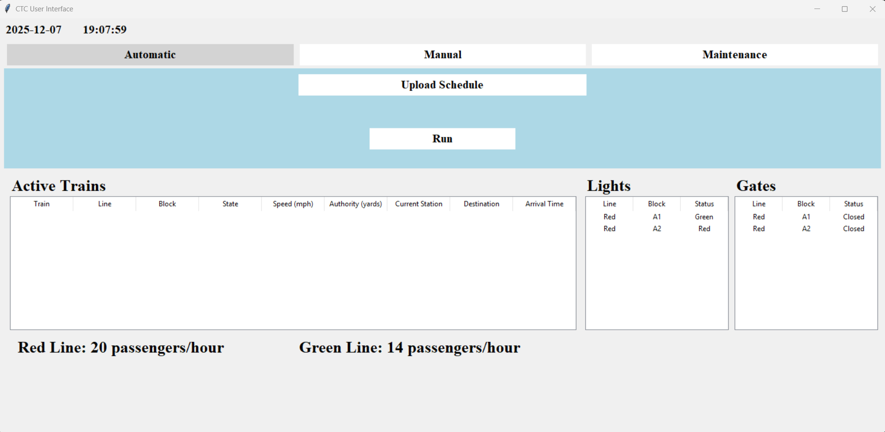

-In automatic mode, the dispatcher ca upload a schedule. The schedule must be a python file.

### CTC Maintenance Mode
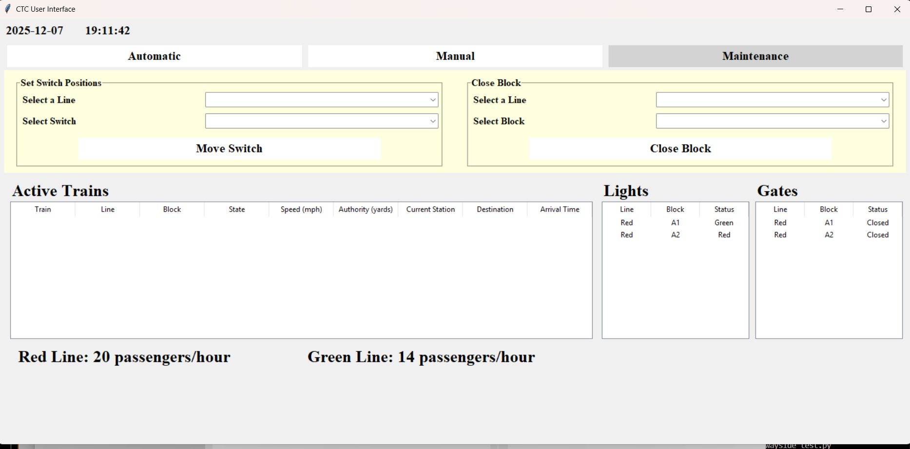 

-In maintenance mode, the dispatcher can manually change switch postions, and close blocks.

### Active Train, Gate, and Light Data

- The center section of the CTC UI displays current active train information, as well as gate and light states.

### Throughput

- The lower section of the CTC UI displays the throughput in passengers per hour of the train.

## SW Wayside Controller
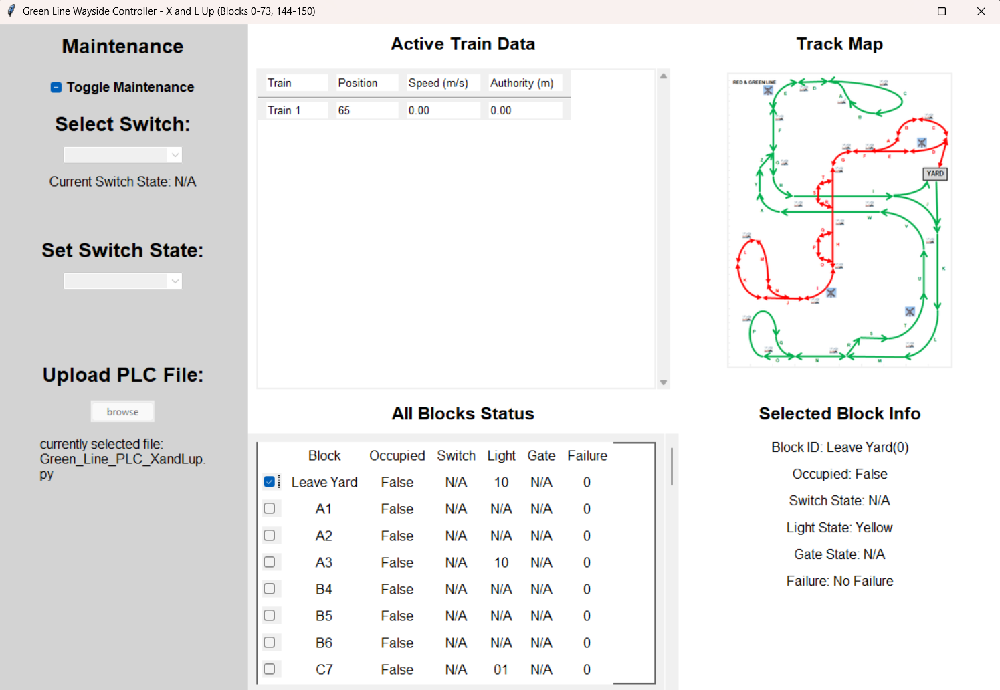

The software wayside controller is defaulted to automatic mode, and must be assigned a plc file prior to running the program, however it can be changed later.

The software wayside controller is responsible for the state of all track feature, such as the switches, gates, and lights. It also recieves suggested speed and authority from the CTC and determines commanded speed and authority for each train.

### Select A Block

The lower right section of the UI is where the user can view all block information and select a block to better view that blocks data

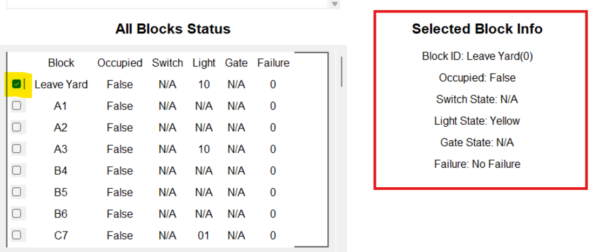

- By selecting a block using a checkbox displayed on the left, the user will see that blocks information in more detail outlined in red on the image above.

### View Active Train Data

The upper middle section of the UI displays all active train information if the train is occupying a block that is within that waysides controlled blocks

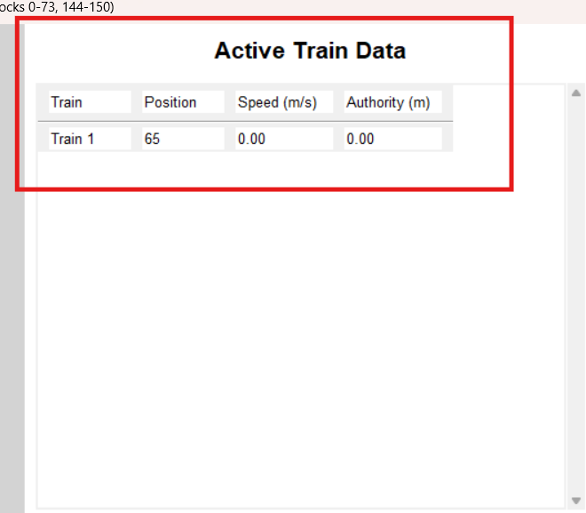

- The train ID, current block position, commanded speed, and commanded authority will be visible. 

### Maintenance Mode

Maintenance mode of the software wayside controller can be accessed by clicking the checkbox labeled "Toggle Maintenance"

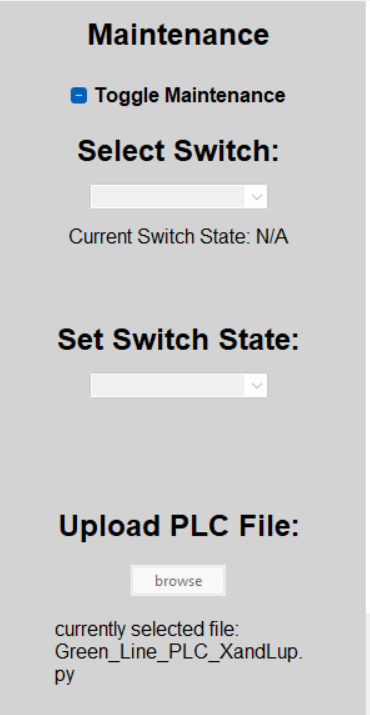

- After maintenace is toggles, the two selection boxes are used to manually change switch positions. Use the upper selection box to select a switch, and the lower one to select the state.
- Below that, the user can select a new plc file by using the "Browse" click button. This button will open file explorer and allow you to select a new .py to run. if your upload is successful, the filename below the click button will update to the new file name.

## HW Wayside Controller

## Train Model

## SW Train Controller
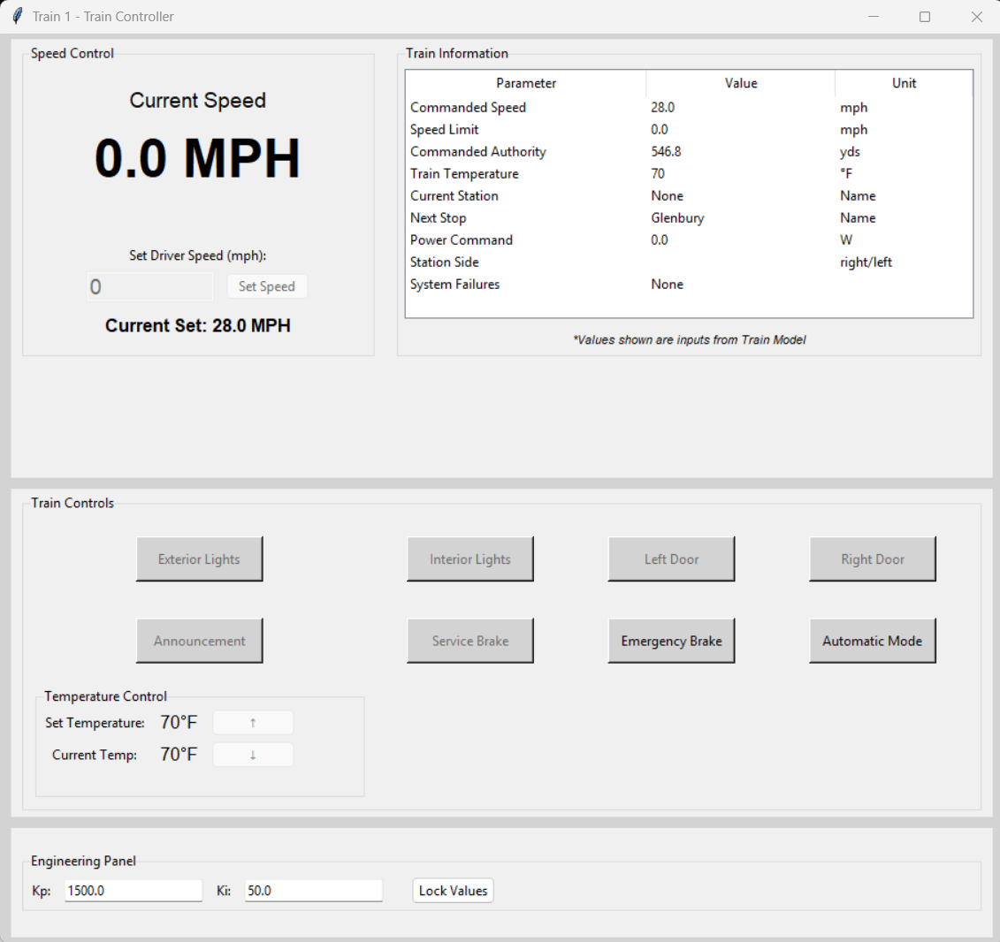

The software train controller is created upon the dispatching of a software train by the CTC module. it is responsible for

### Engineering Panel

The engineering panel located at the bottom of the software train controller UI is where the Kp and Ki of the train must be set.

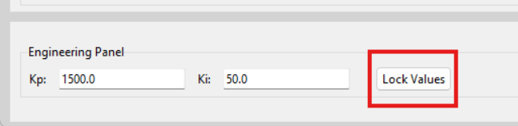

- The Kp and Ki must be set prior to the train moving. Once it is set using the clickbox labeled "Lock Values", It is unabled to be changed again.

### Train Speed

The train speed section located on the top left of the UI displays the current speed of the train in miles per hour.

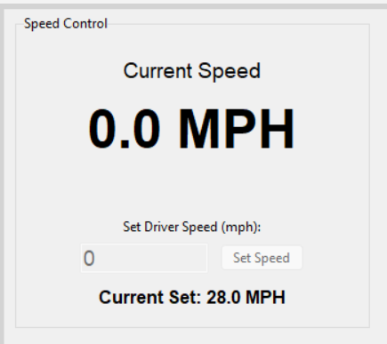

- The train driver is able to i

### Train Information

The train info section located on the top right of the UI...

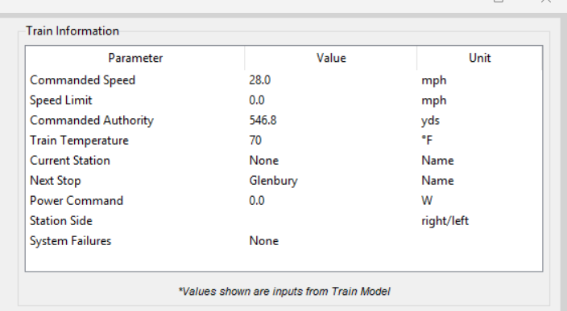

- This section displays...

### Train Controls

The train control section located in the middle of the UI...

- In this section the driver can...
 
## HW Train Controller
